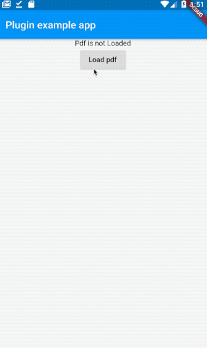
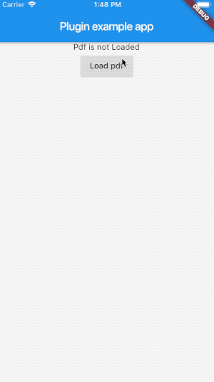

# Pdf Viewer Plugin

[](https://pub.dartlang.org/packages/pdf_viewer_plugin)

A Flutter plugin for IOS and Android providing a simple way to display PDFs.

## Features:

* Display PDF.

 ........... 

## Installation

First, add `pdf_viewer_plugin` as a [dependency in your pubspec.yaml file](https://flutter.io/using-packages/).

### iOS

Add one row to the `ios/Runner/info.plist`:

```
...

<key>io.flutter.embedded_views_preview</key>
<true/>
```

You need to 

### Example

Here is an example flutter app.

```dart
import 'dart:async';
import 'dart:io';
import 'dart:typed_data';

import 'package:flutter/material.dart';
import 'package:http/http.dart' as http;
import 'package:path_provider/path_provider.dart';
import 'package:pdf_viewer_plugin/pdf_viewer_plugin.dart';

void main() {
  PdfView.platform = SurfaceAndroidPdfViewer();
  runApp(MyApp());
}

class MyApp extends StatefulWidget {
  @override
  _MyAppState createState() => _MyAppState();
}

class _MyAppState extends State<MyApp> {
  String? path;

  Future<String> get _localPath async {
    final directory = await getApplicationDocumentsDirectory();

    return directory.path;
  }

  Future<File> get _localFile async {
    final path = await _localPath;
    return File('$path/teste.pdf');
  }

  Future<File> writeCounter(Uint8List stream) async {
    final file = await _localFile;

    // Write the file
    return file.writeAsBytes(stream);
  }

  Future<bool> existsFile() async {
    final file = await _localFile;
    return file.exists();
  }

  Future<Uint8List> fetchPost() async {
    final response = await http.get(Uri.parse('https://expoforest.com.br/wp-content/uploads/2017/05/exemplo.pdf'));
    final responseJson = response.bodyBytes;

    return responseJson;
  }

  void loadPdf() async {
    await writeCounter(await fetchPost());
    await existsFile();
    path = (await _localFile).path;

    if (!mounted) return;

    setState(() {});
  }

  @override
  Widget build(BuildContext context) {
    return MaterialApp(
      home: Scaffold(
        appBar: AppBar(
          title: Text('Plugin example app'),
        ),
        body: Center(
          child: Column(
            children: <Widget>[
              if (path != null)
                Container(
                  height: 300.0,
                  child: PdfView(
                    path: path,
                  ),
                )
              else
                Text("Pdf is not Loaded"),
              ElevatedButton(
                child: Text("Load pdf"),
                onPressed: loadPdf,
              ),
            ],
          ),
        ),
      ),
    );
  }
}
```

[Feedback welcome](https://github.com/lubritto/Pdf_Viewer_Plugin/issues) and
[Pull Requests](https://github.com/lubritto/Pdf_Viewer_Plugin/pulls) are most welcome!
